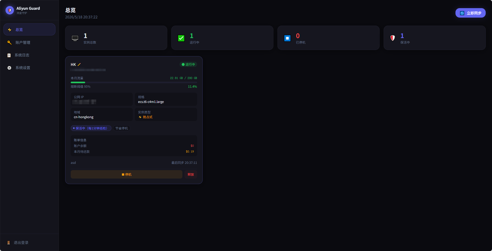
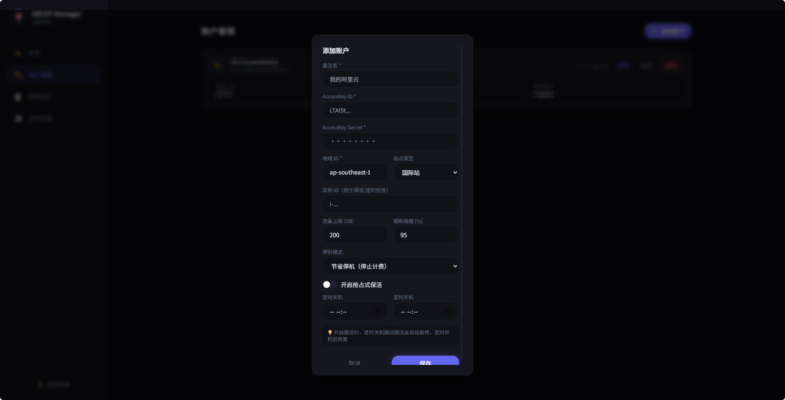
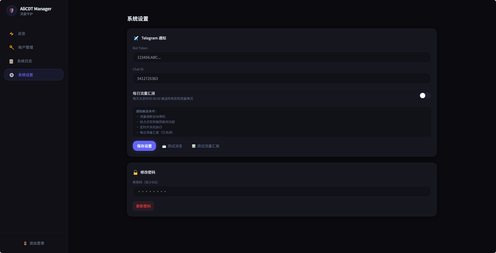

# 🛡️ AliCDT-Manager

阿里云 CDT 流量监控与自动化管理控制台。

## ✨ 功能

- 多账户聚合监控，CDT 流量实时展示
- 流量熔断：超阈值自动停机（节省停机 / 普通停机）
- 抢占式实例保活：被回收自动拉起
- 定时开关机计划
- Telegram 告警通知
- 账单统计（待还款金额，国际站准确）

## 🔑 所需 RAM 权限

```bash
AliyunECSFullAccess
```
```bash
AliyunCDTFullAccess
```
```bash
AliyunBSSFullAccess
```

## 🚀 一键安装

```bash
bash <(curl -fsSL https://raw.githubusercontent.com/lillinlin/AliCDT-Manager/main/install.sh)
```

docker-compose.yml 默认端口为
ports:
     - "127.0.0.1:8000:8000"
在安装完成需要配置 Nginx 反代通过域名访问


## 🛠 手动部署

```bash
mkdir -p /app/alicdt-manager/data && cd /app/alicdt-manager
```
```bash
echo "SECRET_KEY=$(cat /dev/urandom | tr -dc 'a-zA-Z0-9' | head -c 48)" > .env
```
```bash
curl -fsSL https://raw.githubusercontent.com/lillinlin/AliCDT-Manager/main/docker-compose.yml -o docker-compose.yml
```
```bash
docker compose up -d
```

## ✨ 界面截图
  
  
  

## Nginx Cloudflare 配置示例

请手动填写 #端口 #域名 #Pem证书路径 #Key证书路径

```bash
server {
    listen #端口 ssl;
    server_name #域名;

    ssl_certificate     #Pem证书路径;
    ssl_certificate_key #Key证书路径;

    ssl_protocols TLSv1.2 TLSv1.3;
    ssl_ciphers HIGH:!aNULL:!MD5;

    # 禁止访问数据目录
    location ^~ /data/ {
        deny all;
        return 403;
    }

    # 禁止访问 .env 等敏感文件
    location ~ /\. {
        deny all;
        return 403;
    }

    location / {
        proxy_pass http://127.0.0.1:8000;
        proxy_set_header Host $host;
        proxy_set_header X-Real-IP $remote_addr;
        proxy_set_header X-Forwarded-For $proxy_add_x_forwarded_for;
        proxy_set_header X-Forwarded-Proto $scheme;
        proxy_http_version 1.1;
        proxy_set_header Upgrade $http_upgrade;
        proxy_set_header Connection "upgrade";
        proxy_read_timeout 3600s;
    }
}

```

## Tech Stack

- Backend: Python 3.12 + FastAPI + APScheduler + SQLite
- Frontend: Vue 3 + TailwindCSS
- Deploy: Docker + GitHub Actions → ghcr.io
